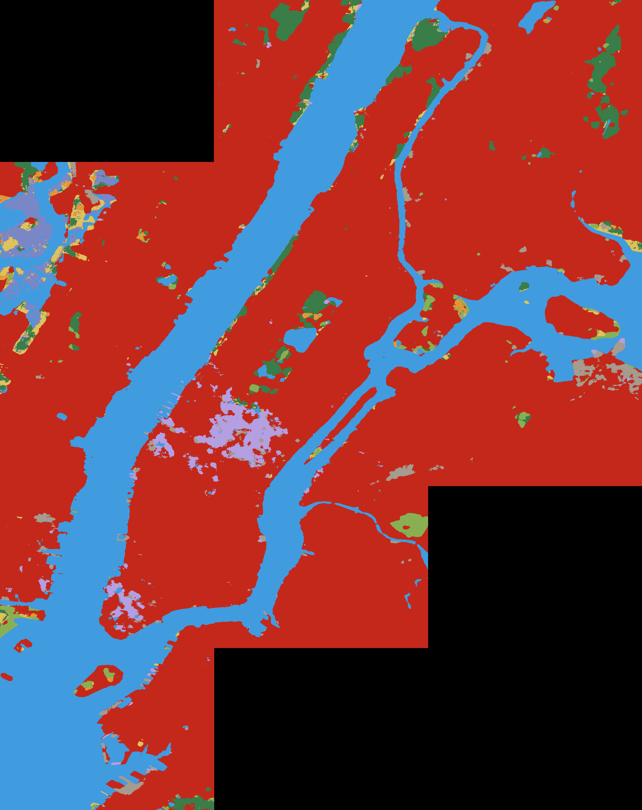
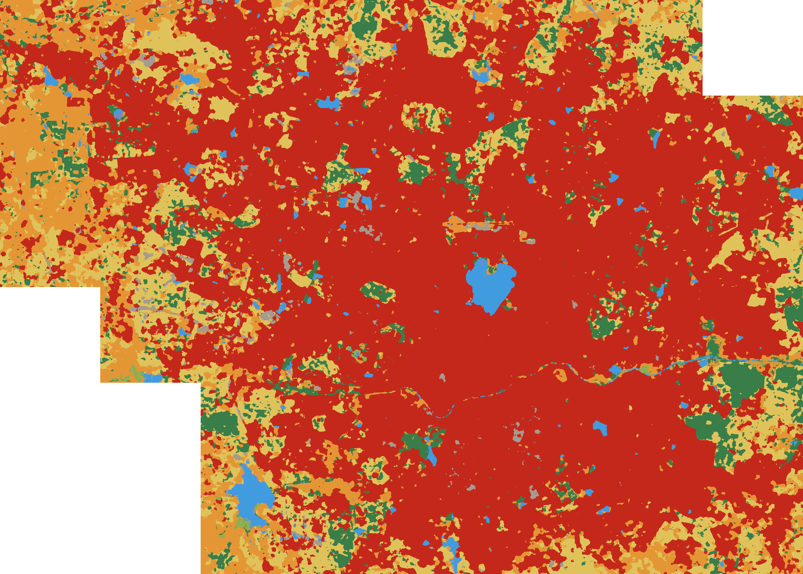
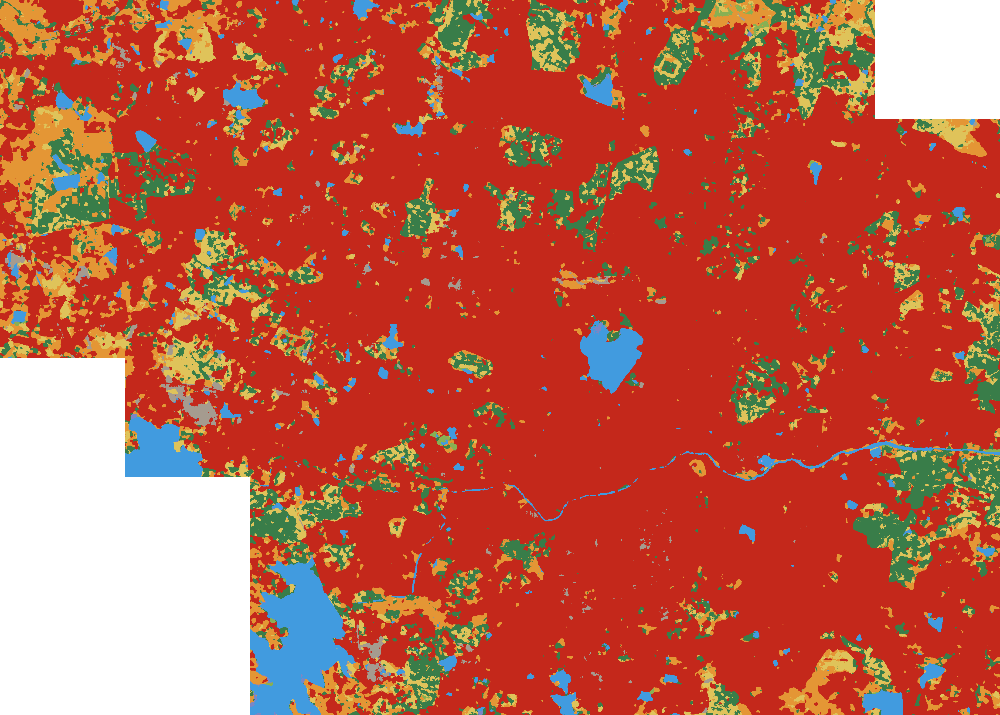
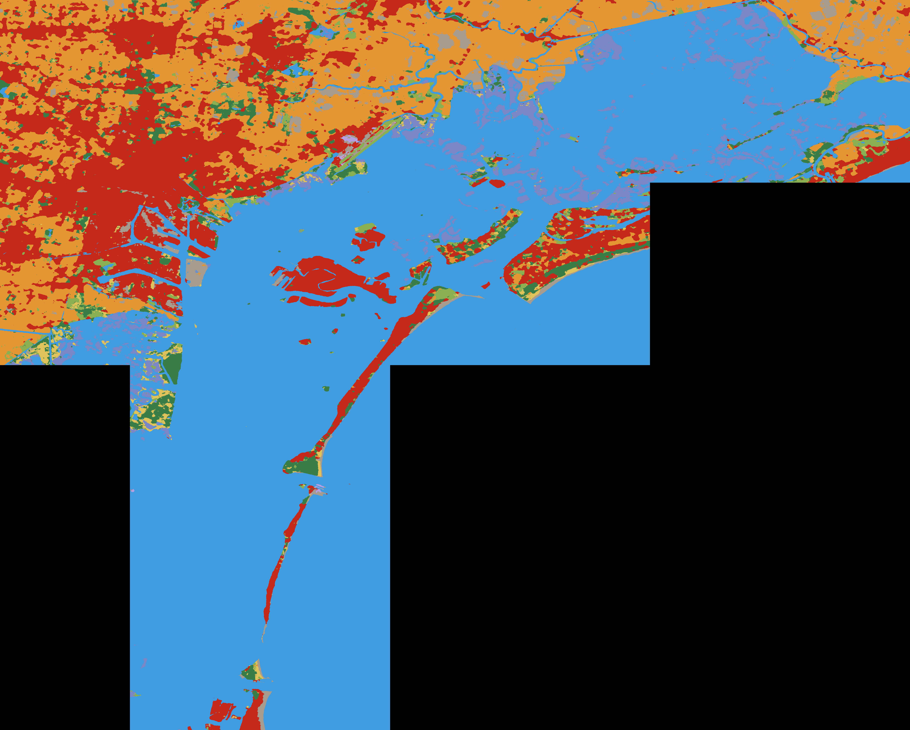
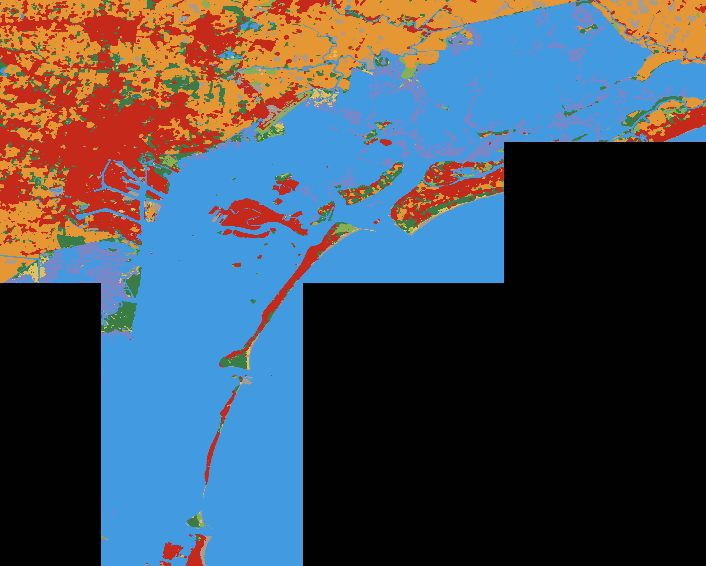

# 🌍 UrDev: Urban Expansion CLI

**UrDev** is an automated spatial analysis pipeline that leverages **Google Earth Engine (GEE)** to analyze and visualize urban land-cover expansion globally. 

Using high-resolution (10-meter) satellite imagery from Google Dynamic World V1, the CLI fetches geographic boundaries via OSMnx, securely accesses Earth Engine imagery through your local Google Cloud Project credentials, and generates composite images comparing land-cover classification across customizable timeframes.

---

## ⚡ Quick Start

### 1. Requirements and Setup
Ensure you have the Python dependencies installed (`osmnx`, `rasterio`, `geopandas`, etc.), and authenticate your local environment with Earth Engine:
```bash
earthengine authenticate
```
*Note: Your Earth Engine authentication must be associated with a valid Google Cloud Project. If initialization fails, link your project by running `earthengine set_project YOUR_PROJECT_ID`.*

### 2. Generating Geospatial Data
You can pass any globally recognized location to the entrypoint script. The pipeline will automatically geocode the administrative boundary, update the pipeline configuration, download the requisite tiles from Earth Engine, and generate the final image mosaics.
```bash
python generate.py --location "Manhattan, New York" --start-year 2020 --end-year 2021
```

---

## 📸 Generated Outputs

Because the UrDev pipeline is dynamically driven by the configuration files and OSMnx queries, you can run it on varying geographical regions. Below are examples of the pipeline outputs demonstrating land-cover transitions over time.

### 🏙️ Manhattan, New York (2020 vs 2021)
| 2020 | 2021 |
|:---:|:---:|
|  |  |

### 🇮🇳 Hyderabad, India (2016 vs 2026)
| 2016 | 2026 |
|:---:|:---:|
|  |  |

### 🛶 Venice, Italy (2016 vs 2026)
| 2016 | 2026 |
|:---:|:---:|
|  |  |


*(Legend: Red denotes built-up/urban infrastructure, Green denotes vegetation, Blue denotes water bodies).*

### 📊 10-Year Statistical Trend (Manhattan, NY)
Because the pipeline automatically runs `generate_analysis.py` after stitching the imagery, it exports exact pixel-area calculations (in km²) for every landcover class. 

Here is the exact progression of Manhattan's landcover over the decade:

| Year | Water | Trees | Grass | Flooded Veg | Crops | Shrub/Scrub | Built | Bare | Snow/Ice |
|:---:|:---:|:---:|:---:|:---:|:---:|:---:|:---:|:---:|:---:|
| **2016** | 95.25 | 5.85 | 2.35 | 4.25 | 0.80 | 1.97 | 266.76 | 2.65 | 2.11 |
| **2017** | 96.50 | 6.02 | 1.63 | 2.73 | 0.92 | 1.67 | 247.43 | 5.54 | 19.55 |
| **2018** | 93.82 | 5.65 | 2.07 | 4.50 | 0.84 | 2.68 | 267.89 | 2.93 | 1.61 |
| **2019** | 94.48 | 9.18 | 2.26 | 3.73 | 0.53 | 2.17 | 265.01 | 2.73 | 1.91 |
| **2020** | 93.67 | 9.07 | 2.61 | 4.21 | 0.70 | 2.37 | 264.01 | 3.90 | 1.45 |
| **2021** | 95.05 | 8.64 | 2.53 | 3.26 | 0.71 | 2.54 | 260.83 | 3.91 | 4.52 |
| **2022** | 94.79 | 6.73 | 2.55 | 3.75 | 0.63 | 2.66 | 263.05 | 3.74 | 4.10 |
| **2023** | 94.86 | 9.01 | 2.42 | 3.12 | 0.40 | 2.69 | 263.44 | 3.64 | 2.41 |
| **2024** | 94.89 | 9.72 | 2.22 | 2.84 | 0.99 | 2.18 | 261.09 | 2.66 | 5.38 |
| **2025** | 94.12 | 9.83 | 2.15 | 2.66 | 0.32 | 3.75 | 259.76 | 4.06 | 5.35 |
| **2026** | 94.68 | 12.30 | 2.15 | 2.36 | 0.70 | 1.73 | 261.74 | 2.34 | 4.00 |

### 📊 10-Year Statistical Trend (GHMC, Hyderabad)
For comparison, here is the exact progression of Hyderabad's (GHMC) landcover, showcasing massive urban expansion:

| Year | Water | Trees | Grass | Flooded Veg | Crops | Shrub/Scrub | Built | Bare | Snow/Ice |
|:---:|:---:|:---:|:---:|:---:|:---:|:---:|:---:|:---:|:---:|
| **2016** | 21.32 | 70.29 | 1.92 | 0.77 | 137.47 | 171.23 | 744.04 | 11.37 | 0.00 |
| **2017** | 38.19 | 65.02 | 0.93 | 1.14 | 141.18 | 140.52 | 755.38 | 16.04 | 0.00 |
| **2018** | 45.91 | 115.51 | 0.49 | 3.14 | 138.30 | 87.49 | 758.66 | 8.91 | 0.00 |
| **2019** | 34.46 | 67.27 | 1.03 | 0.79 | 129.59 | 117.46 | 795.66 | 12.15 | 0.00 |
| **2020** | 27.86 | 93.40 | 3.26 | 1.07 | 113.88 | 100.27 | 810.37 | 8.30 | 0.00 |
| **2021** | 51.71 | 93.73 | 0.89 | 3.29 | 123.92 | 75.79 | 797.82 | 11.24 | 0.00 |
| **2022** | 54.23 | 95.72 | 0.99 | 2.01 | 112.58 | 65.88 | 816.08 | 10.91 | 0.00 |
| **2023** | 54.78 | 124.73 | 2.06 | 2.08 | 91.43 | 50.64 | 825.39 | 7.29 | 0.00 |
| **2024** | 52.36 | 75.45 | 0.70 | 0.83 | 97.91 | 63.69 | 853.19 | 14.27 | 0.00 |
| **2025** | 51.33 | 99.30 | 2.57 | 0.79 | 97.43 | 50.19 | 849.81 | 6.99 | 0.00 |
| **2026** | 50.71 | 103.98 | 1.94 | 0.95 | 90.69 | 53.76 | 847.65 | 8.71 | 0.01 |

---

## 📁 System Architecture
- **`generate.py`**: The main CLI orchestrator. It handles geocoding via OpenStreetMap, configuration file rewriting, and subprocess execution for the pipeline.
- **`pipeline/`**: The core modular Python codebase. It contains functions for fetching geometries (`boundary.py`), defining standardized grids (`tiler.py`), and managing metadata schemas (`metadata.py`).
- **`scripts/`**: Executable runners that perform the heavy lifting:
  - `build_dataset.py`: Coordinates the asynchronous fetching and downloading of Earth Engine tiles into a local storage structure.
  - `generate_mosaic.py`: Utilizes `rasterio` and `WarpedVRT` to merge the individual geographical tiles into a cohesive raster array, applying color mappings before exporting as a `.png` and `.tif`.
  - `visualize_dw.py`: Provides debugging tools to visually compare individual tile segments before the final merge.

### Data Output Structure
All raw and processed files are saved into an auto-generated, isolated data directory specific to the location queried. For example, running the pipeline for Manhattan generates the `urban_dataset_manhattan_new_york/` directory with the following structure:

```text
urban_dataset_manhattan_new_york/
├── dataset.json           # Master metadata file for the dataset (classes, region info)
├── metadata/
│   └── tiles.csv          # Catalog of every downloaded tile, bounding boxes, and pixel counts
├── dynamic_world/         # Raw, unmodified GeoTIFF tiles downloaded from Earth Engine
│   ├── 2020/
│   │   ├── tile_r000_c001.tif
│   │   └── ...
│   └── 2021/
└── verification/          # Final processed outputs and visual mosaics
    ├── 2020/
    │   ├── mosaic.png         # The fully stitched, color-mapped composite image
    │   └── mosaic_labels.tif  # The raw stitched raster data preserving original labels
    └── 2021/
```

*(Note: These data output directories are explicitly ignored by version control to prevent inflating repository size with large TIFF files).*
